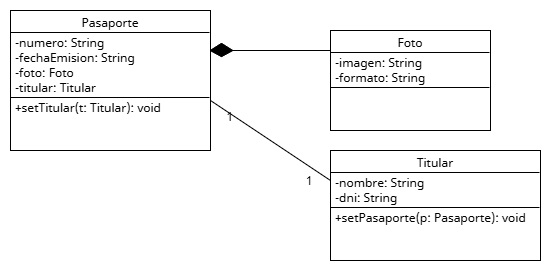
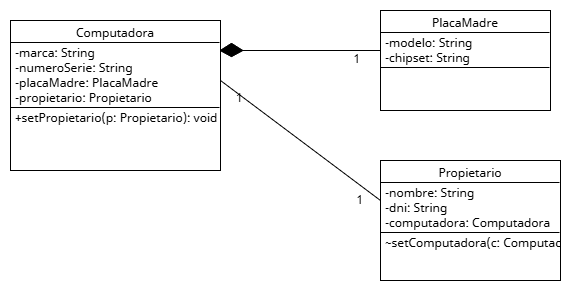
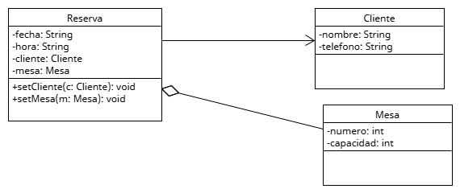
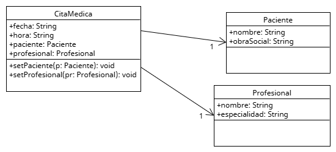
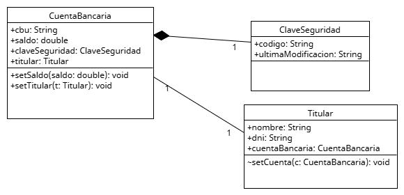

# Entrega clase cinco — Relaciones 1 a 1, dependencias de uso y creación

Trabajo Práctico:   Relaciones UML 1 a 1
Alumno: Martínez Luciano Joaquín

Consignas:

Link al código:
https://github.com/lucianomartinez27/UTNProgramacionII/tree/master/src/clasecinco

A continuación se listan los ejercicios del paquete `clasecinco`. Cada sección incluye el código Java de las clases involucradas y, al final, el diagrama asociado).

---

## Ejercicio 1 — Pasaporte, Foto, Titular

Clases:

```java
// src/clasecinco/ejercicio1/Pasaporte.java
package clasecinco.ejercicio1;

// Composición: Pasaporte -> Foto
// Asociación bidireccional: Pasaporte <-> Titular
public class Pasaporte {
    private final String numero;
    private final String fechaEmision;
    private Foto foto; // composición: creada y destruida con Pasaporte
    private Titular titular; // asociación bidireccional

    public Pasaporte(String numero, String fechaEmision, Titular titular, String imagen, String formato) {
        this.numero = numero;
        this.fechaEmision = fechaEmision;
        this.foto = new Foto(imagen, formato);
        this.titular = titular;
    }

    public void setTitular(Titular titular) {
        this.titular = titular;
    }
}
```

```java
// src/clasecinco/ejercicio1/Foto.java
package clasecinco.ejercicio1;

public class Foto {
    private final String imagen;
    private final String formato;

    public Foto(String imagen, String formato) {
        this.imagen = imagen;
        this.formato = formato;
    }

}
```

```java
// src/clasecinco/ejercicio1/Titular.java
package clasecinco.ejercicio1;

public class Titular {
    private final String nombre;
    private final String dni;
    private Pasaporte pasaporte; // asociación bidireccional

    public Titular(String nombre, String dni) {
        this.nombre = nombre;
        this.dni = dni;
    }

    public void setPasaporte(Pasaporte pasaporte) {
        this.pasaporte = pasaporte;
    }
}
```

Diagrama:



---

## Ejercicio 2 — Celular, Bateria, Usuario

```java
// src/clasecinco/ejercicio2/Celular.java
package clasecinco.ejercicio2;

// Agregación: Celular -> Bateria
// Asociación bidireccional: Celular <-> Usuario
public class Celular {
    private final String imei;
    private final String marca;
    private final String modelo;
    private Bateria bateria; // agregación (inyectada por setter)
    private Usuario usuario; // bidireccional

    public Celular(String imei, String marca, String modelo) {
        this.imei = imei;
        this.marca = marca;
        this.modelo = modelo;
    }

    public void setUsuario(Usuario usuario) {
        this.usuario = usuario;
    }

    public void setBateria(Bateria bateria) {
        this.bateria = bateria;
    }
}
```

```java
// src/clasecinco/ejercicio2/Bateria.java
package clasecinco.ejercicio2;

public class Bateria {
    private final String modelo;
    private final int capacidad; // mAh

    public Bateria(String modelo, int capacidad) {
        this.modelo = modelo;
        this.capacidad = capacidad;
    }

}
```

```java
// src/clasecinco/ejercicio2/Usuario.java
package clasecinco.ejercicio2;

public class Usuario {
    private final String nombre;
    private final String dni;
    private Celular celular; // bidireccional

    public Usuario(String nombre, String dni) {
        this.nombre = nombre;
        this.dni = dni;
    }

    public void setCelular(Celular celular) {
        this.celular = celular;
    }
}
```

Diagrama:


---

## Ejercicio 3 — Libro, Autor, Editorial

```java
// src/clasecinco/ejercicio3/Libro.java
package clasecinco.ejercicio3;

// Asociación unidireccional: Libro -> Autor
// Agregación: Libro -> Editorial
public class Libro {
    private final String titulo;
    private final String isbn;
    private Autor autor;
    private Editorial editorial;

    public Libro(String titulo, String isbn, Editorial editorial) {
        this.titulo = titulo;
        this.isbn = isbn;
        this.editorial = editorial;
    }

    public void setAutor(Autor autor) {
        this.autor = autor;
    }
}
```

```java
// src/clasecinco/ejercicio3/Autor.java
package clasecinco.ejercicio3;

public class Autor {
    private final String nombre;
    private final String nacionalidad;

    public Autor(String nombre, String nacionalidad) {
        this.nombre = nombre;
        this.nacionalidad = nacionalidad;
    }

}
```

```java
// src/clasecinco/ejercicio3/Editorial.java
package clasecinco.ejercicio3;

public class Editorial {
    private final String nombre;
    private final String direccion;

    public Editorial(String nombre, String direccion) {
        this.nombre = nombre;
        this.direccion = direccion;
    }

}
```

Diagrama:


---

## Ejercicio 4 — TarjetaDeCredito, Cliente, Banco

```java
// src/clasecinco/ejercicio4/TarjetaDeCredito.java
package clasecinco.ejercicio4;

// Asociación bidireccional: TarjetaDeCredito <-> Cliente
// Agregación: TarjetaDeCredito -> Banco
public class TarjetaDeCredito {
    private final String numero;
    private final String fechaVencimiento;
    private Cliente cliente;
    private Banco banco;

    public TarjetaDeCredito(String numero, String fechaVencimiento) {
        this.numero = numero;
        this.fechaVencimiento = fechaVencimiento;
    }

    public void setBanco(Banco banco) {
        this.banco = banco;
    }

    public void setCliente(Cliente cliente) {
        this.cliente = cliente;
    }
}
```

```java
// src/clasecinco/ejercicio4/Cliente.java
package clasecinco.ejercicio4;

public class Cliente {
    private final String nombre;
    private final String dni;
    private TarjetaDeCredito tarjeta; // bidireccional

    public Cliente(String nombre, String dni) {
        this.nombre = nombre;
        this.dni = dni;
    }

    public void setTarjeta(TarjetaDeCredito tarjeta) {
        this.tarjeta = tarjeta;
    }
}
```

```java
// src/clasecinco/ejercicio4/Banco.java
package clasecinco.ejercicio4;

public class Banco {
    private final String nombre;
    private final String cuit;

    public Banco(String nombre, String cuit) {
        this.nombre = nombre;
        this.cuit = cuit;
    }

}
```

Diagrama:


---

## Ejercicio 5 — Computadora, PlacaMadre, Propietario

```java
// src/clasecinco/ejercicio5/Computadora.java
package clasecinco.ejercicio5;

// Composición: Computadora -> PlacaMadre
// Asociación bidireccional: Computadora <-> Propietario
public class Computadora {
    private final String marca;
    private final String numeroSerie;
    private final PlacaMadre placaMadre; // composición
    private Propietario propietario; // bidireccional

    public Computadora(String marca, String numeroSerie, String modeloPlaca, String chipset) {
        this.marca = marca;
        this.numeroSerie = numeroSerie;
        this.placaMadre = new PlacaMadre(modeloPlaca, chipset);
    }

    public void setPropietario(Propietario propietario) {
        this.propietario = propietario;
    }
}
```

```java
// src/clasecinco/ejercicio5/PlacaMadre.java
package clasecinco.ejercicio5;

public class PlacaMadre {
    private final String modelo;
    private final String chipset;

    public PlacaMadre(String modelo, String chipset) {
        this.modelo = modelo;
        this.chipset = chipset;
    }

}
```

```java
// src/clasecinco/ejercicio5/Propietario.java
package clasecinco.ejercicio5;

public class Propietario {
    private final String nombre;
    private final String dni;
    private Computadora computadora; // bidireccional

    public Propietario(String nombre, String dni) {
        this.nombre = nombre;
        this.dni = dni;
    }

    public void setComputadora(Computadora computadora) {
        this.computadora = computadora;
    }
}
```

Diagrama:



---

## Ejercicio 6 — Reserva, Cliente, Mesa

```java
// src/clasecinco/ejercicio6/Reserva.java
package clasecinco.ejercicio6;

// Asociación unidireccional: Reserva -> Cliente
// Agregación: Reserva -> Mesa
public class Reserva {
    private final String fecha;
    private final String hora;
    private Cliente cliente;
    private Mesa mesa;

    public Reserva(String fecha, String hora, Mesa mesa) {
        this.fecha = fecha;
        this.hora = hora;
        this.mesa = mesa;
    }

    public void setCliente(Cliente cliente) {
        this.cliente = cliente;
    }
}
```

```java
// src/clasecinco/ejercicio6/Cliente.java
package clasecinco.ejercicio6;

public class Cliente {
    private final String nombre;
    private final String telefono;

    public Cliente(String nombre, String telefono) {
        this.nombre = nombre;
        this.telefono = telefono;
    }

}
```

```java
// src/clasecinco/ejercicio6/Mesa.java
package clasecinco.ejercicio6;

public class Mesa {
    private final int numero;
    private final int capacidad;

    public Mesa(int numero, int capacidad) {
        this.numero = numero;
        this.capacidad = capacidad;
    }

}
```

Diagrama:



---

## Ejercicio 7 — Vehiculo, Motor, Conductor

```java
// src/clasecinco/ejercicio7/Vehiculo.java
package clasecinco.ejercicio7;

// Agregación: Vehiculo -> Motor
// Asociación bidireccional: Vehiculo <-> Conductor
public class Vehiculo {
    private final String patente;
    private final String modelo;
    private Motor motor;
    private Conductor conductor;

    public Vehiculo(String patente, String modelo) {
        this.patente = patente;
        this.modelo = modelo;
    }

}
```

```java
// src/clasecinco/ejercicio7/Motor.java
package clasecinco.ejercicio7;

public class Motor {
    private final String tipo;
    private final String numeroSerie;

    public Motor(String tipo, String numeroSerie) {
        this.tipo = tipo;
        this.numeroSerie = numeroSerie;
    }

}
```

```java
// src/clasecinco/ejercicio7/Conductor.java
package clasecinco.ejercicio7;

public class Conductor {
    private final String nombre;
    private final String licencia;
    private Vehiculo vehiculo; // bidireccional

    public Conductor(String nombre, String licencia) {
        this.nombre = nombre;
        this.licencia = licencia;
    }

}
```

Diagrama:


---

## Ejercicio 8 — Documento, FirmaDigital, Usuario

```java
// src/clasecinco/ejercicio8/Documento.java
package clasecinco.ejercicio8;

// Composición: Documento -> FirmaDigital
// Agregación: FirmaDigital -> Usuario
public class Documento {
    private final String titulo;
    private final String contenido;
    private final FirmaDigital firmaDigital;

    public Documento(String titulo, String contenido, String codigoHash, String fecha, Usuario usuario) {
        this.titulo = titulo;
        this.contenido = contenido;
        this.firmaDigital = new FirmaDigital(codigoHash, fecha, usuario);
    }

}
```

```java
// src/clasecinco/ejercicio8/FirmaDigital.java
package clasecinco.ejercicio8;

public class FirmaDigital {
    private final String codigoHash;
    private final String fecha;
    private final Usuario usuario; // agregación

    public FirmaDigital(String codigoHash, String fecha, Usuario usuario) {
        this.codigoHash = codigoHash;
        this.fecha = fecha;
        this.usuario = usuario;
    }

}
```

```java
// src/clasecinco/ejercicio8/Usuario.java
package clasecinco.ejercicio8;

public class Usuario {
    private final String nombre;
    private final String email;

    public Usuario(String nombre, String email) {
        this.nombre = nombre;
        this.email = email;
    }

    public String getNombre() { return nombre; }
}
```

Diagrama:


---

## Ejercicio 9 — CitaMedica, Paciente, Profesional

```java
// src/clasecinco/ejercicio9/CitaMedica.java
package clasecinco.ejercicio9;

// Asociación unidireccional: CitaMedica -> Paciente, CitaMedica -> Profesional
public class CitaMedica {
    private final String fecha;
    private final String hora;
    private Paciente paciente;
    private Profesional profesional;

    public CitaMedica(String fecha, String hora) {
        this.fecha = fecha;
        this.hora = hora;
    }

}
```

```java
// src/clasecinco/ejercicio9/Paciente.java
package clasecinco.ejercicio9;

public class Paciente {
    private final String nombre;
    private final String obraSocial;

    public Paciente(String nombre, String obraSocial) {
        this.nombre = nombre;
        this.obraSocial = obraSocial;
    }

}
```

```java
// src/clasecinco/ejercicio9/Profesional.java
package clasecinco.ejercicio9;

public class Profesional {
    private final String nombre;
    private final String especialidad;

    public Profesional(String nombre, String especialidad) {
        this.nombre = nombre;
        this.especialidad = especialidad;
    }

}
```

Diagrama:



---

## Ejercicio 10 — CuentaBancaria, ClaveSeguridad, Titular

```java
// src/clasecinco/ejercicio10/CuentaBancaria.java
package clasecinco.ejercicio10;

// Composición: CuentaBancaria -> ClaveSeguridad
// Asociación bidireccional: CuentaBancaria <-> Titular
public class CuentaBancaria {
    private final String cbu;
    private double saldo;
    private final ClaveSeguridad claveSeguridad;
    private Titular titular;

    public CuentaBancaria(String cbu, double saldo, String codigo, String ultimaModificacion, Titular titular) {
        this.cbu = cbu;
        this.saldo = saldo;
        this.claveSeguridad = new ClaveSeguridad(codigo, ultimaModificacion);
    }

}
```

```java
// src/clasecinco/ejercicio10/ClaveSeguridad.java
package clasecinco.ejercicio10;

public class ClaveSeguridad {
    public ClaveSeguridad(String codigo, String ultimaModificacion) {
    }
}
```

```java
// src/clasecinco/ejercicio10/Titular.java
package clasecinco.ejercicio10;

import clasecinco.ejercicio1.Pasaporte;

public class Titular {
    private final String nombre;
    private final String dni;
    private Pasaporte pasaporte; // asociación bidireccional

    public Titular(String nombre, String dni) {
        this.nombre = nombre;
        this.dni = dni;
    }

}
```

Diagrama:



---

## Ejercicio 11 — Reproductor, Cancion, Artista (Dependencia de uso)

```java
// src/clasecinco/ejercicio11/Cancion.java
package clasecinco.ejercicio11;

// Asociación unidireccional: Cancion -> Artista
public class Cancion {
    private final String titulo;
    private Artista artista;

    public Cancion(String titulo) {
        this.titulo = titulo;
    }

    public void setArtista(Artista artista) {
        this.artista = artista;
    }

    public String getTitulo() { return titulo; }
    public Artista getArtista() { return artista; }
}
```

```java
// src/clasecinco/ejercicio11/Artista.java
package clasecinco.ejercicio11;

public class Artista {
    private final String nombre;
    private final String genero;

    public Artista(String nombre, String genero) {
        this.nombre = nombre;
        this.genero = genero;
    }

    public String getNombre() { return nombre; }
    public String getGenero() { return genero; }
}
```

```java
// src/clasecinco/ejercicio11/Reproductor.java
package clasecinco.ejercicio11;

// Dependencia de uso: Reproductor.reproducir(Cancion)
public class Reproductor {

    public void reproducir(Cancion cancion) {
        // No se guarda como atributo: solo se usa
        // Simulación reproducción
        System.out.println("Reproduciendo: " + cancion.getTitulo());
    }
}
```

Diagrama:


---

## Ejercicio 12 — Calculadora, Impuesto, Contribuyente (Dependencia de uso)

```java
// src/clasecinco/ejercicio12/Impuesto.java
package clasecinco.ejercicio12;

// Asociación unidireccional: Impuesto -> Contribuyente
public class Impuesto {
    private final double monto;
    private Contribuyente contribuyente;

    public Impuesto(double monto) {
        this.monto = monto;
    }

    public void setContribuyente(Contribuyente contribuyente) {
        this.contribuyente = contribuyente;
    }

    public double getMonto() { return monto; }
    public Contribuyente getContribuyente() { return contribuyente; }
}
```

```java
// src/clasecinco/ejercicio12/Contribuyente.java
package clasecinco.ejercicio12;

public class Contribuyente {
    private final String nombre;
    private final String cuil;

    public Contribuyente(String nombre, String cuil) {
        this.nombre = nombre;
        this.cuil = cuil;
    }

    public String getNombre() { return nombre; }
    public String getCuil() { return cuil; }
}
```

```java
// src/clasecinco/ejercicio12/Calculadora.java
package clasecinco.ejercicio12;

// Dependencia de uso: Calculadora.calcular(Impuesto)
public class Calculadora {

    public void calcular(Impuesto impuesto) {
        // Uso sin guardar como atributo
        double monto = impuesto.getMonto() + 0.1;
        // Simulación de cálculo
        System.out.println("Calculando impuesto sobre monto: " + monto);
    }
}
```

Diagrama:


---

## Ejercicio 13 — GeneradorQR, Usuario, CodigoQR (Dependencia de creación)

```java
// src/clasecinco/ejercicio13/CodigoQR.java
package clasecinco.ejercicio13;

// Asociación unidireccional: CodigoQR -> Usuario
public class CodigoQR {
    private final String valor;
    private final Usuario usuario;

    public CodigoQR(String valor, Usuario usuario) {
        this.valor = valor;
        this.usuario = usuario;
    }

    public String getValor() { return valor; }
    public Usuario getUsuario() { return usuario; }
}
```

```java
// src/clasecinco/ejercicio13/Usuario.java
package clasecinco.ejercicio13;

public class Usuario {
    private final String nombre;
    private final String email;

    public Usuario(String nombre, String email) {
        this.nombre = nombre;
        this.email = email;
    }

    public String getNombre() { return nombre; }
    public String getEmail() { return email; }
}
```

```java
// src/clasecinco/ejercicio13/GeneradorQR.java
package clasecinco.ejercicio13;

// Dependencia de creación: GeneradorQR.generar(String, Usuario)
public class GeneradorQR {

    public void generar(String valor, Usuario usuario) {
        // Crea un CodigoQR pero no lo conserva como atributo
        if (valor == null) valor = "";
        CodigoQR qr = new CodigoQR(valor, usuario);
        // Simulación mínima de uso inmediato
        System.out.println("QR generado para usuario: " + (usuario != null ? usuario.getNombre() : "(desconocido)") +
                " con valor: " + qr.getValor());
    }
}
```

Diagrama:


---

## Ejercicio 14 — EditorVideo, Proyecto, Render (Dependencia de creación)

```java
// src/clasecinco/ejercicio14/Render.java
package clasecinco.ejercicio14;

// Asociación unidireccional: Render -> Proyecto
public class Render {
    private final String formato;
    private final Proyecto proyecto;

    public Render(String formato, Proyecto proyecto) {
        this.formato = formato;
        this.proyecto = proyecto;
    }

    public String getFormato() { return formato; }
    public Proyecto getProyecto() { return proyecto; }
}
```

```java
// src/clasecinco/ejercicio14/Proyecto.java
package clasecinco.ejercicio14;

public class Proyecto {
    private final String nombre;
    private final int duracionMin;

    public Proyecto(String nombre, int duracionMin) {
        this.nombre = nombre;
        this.duracionMin = duracionMin;
    }

    public String getNombre() { return nombre; }
    public int getDuracionMin() { return duracionMin; }
}
```

```java
// src/clasecinco/ejercicio14/EditorVideo.java
package clasecinco.ejercicio14;

// Dependencia de creación: EditorVideo.exportar(String, Proyecto)
public class EditorVideo {

    public void exportar(String formato, Proyecto proyecto) {
        // Crea un Render pero no lo conserva como atributo
        if (formato == null) formato = "mp4";
        Render render = new Render(formato, proyecto);
        // Simulación mínima de uso inmediato
        System.out.println("Exportando proyecto '" + (proyecto != null ? proyecto.getNombre() : "(sin nombre)") +
                "' en formato: " + render.getFormato());
    }
}
```

Diagrama:


